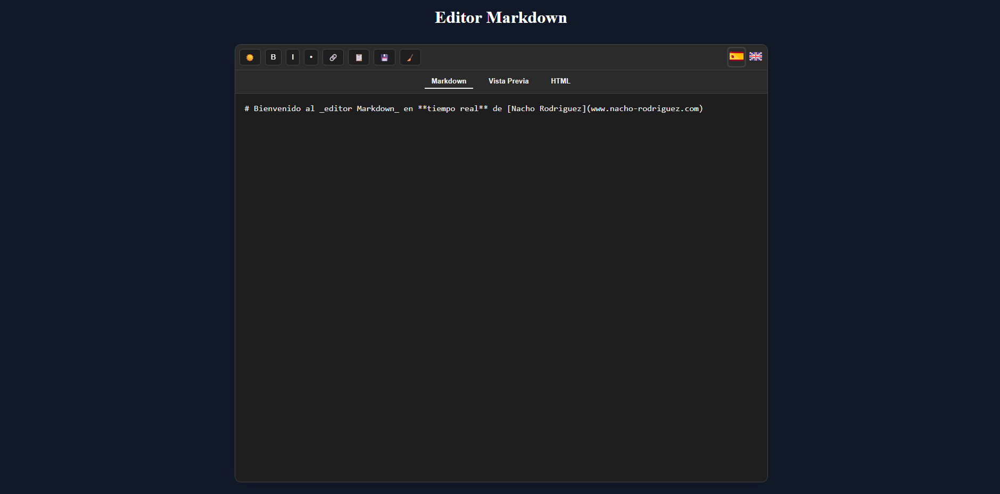

# 📘 Markdown Live Editor

Un completo y estilizado **editor Markdown con vista previa en tiempo real**, resaltado de sintaxis, modo oscuro/claro, idioma español/inglés, exportación y más. Este proyecto forma parte de mi portfolio y está diseñado para mostrar una implementación profesional de un componente Vue autocontenible.




---

## 🚀 Tecnologías utilizadas

- [Vue 3](https://vuejs.org/) + Composition API
- [Typescript](https://www.typescriptlang.org/) — Javascript superset
- [Marked](https://github.com/markedjs/marked) — parser de Markdown
- [highlight.js](https://highlightjs.org/) — resaltado de sintaxis
- [tailwind](https://tailwindcss.com/) + CSS puro con variables para tema claro/oscuro

---

## 🗂️ Estructura principal

```
src/
├── components/
│   └── MarkdownEditor.vue     # Componente principal de markdown
├── assets/
│   └── flags/           # Banderas de idiomas
├── locales/
│   ├── en.json
│   └── es.json
├── App.vue              # Componente raíz
├── main.ts              # Punto de entrada
└── ...
```

---

## ✨ Funcionalidades

- ✅ Edición Markdown con envoltorios (negrita, cursiva, enlaces…)
- ✅ Vista previa en vivo con estilos tipográficos cuidados
- ✅ Vista del HTML crudo generado
- ✅ Modo oscuro/claro con persistencia local
- ✅ Selector de idioma español/inglés con persistencia local
- ✅ Exportación a `.html` con estilo básico embebido
- ✅ Copiar HTML al portapapeles
- ✅ Exportación a PDF con estilo básico embebido
- ✅ Limpieza rápida del contenido
- ✅ Responsive y autocontenible

---

## 🧩 Estructura del componente

- `template`: Vista con toolbar, pestañas y paneles
- `script setup`: Lógica clara, organizada por bloques funcionales
- `style`: Completamente comentado y contenido en el propio archivo
- ✅ No requiere ningún CSS externo adicional

---

## 🛠️ Instalación y uso

```bash
# Clona el repositorio
git clone https://github.com/KVOTHE73/live-markdown-editor.git
cd markdown-editor

# Instala dependencias
npm install

# Ejecuta en modo desarrollo
npm run dev
```

📅 Metainformación
📁 Proyecto: Markdown Editor

🧠 Autor: [Nacho Rodríguez](https://www.nacho-rodriguez.com)

📦 Tipo: Componente Vue 3 autocontenible

🎯 Finalidad: Portfolio personal / Demostración de habilidades frontend

🔗 Licencia: MIT

📣 Puedes ver una demo en vivo aquí:
👉 https://kvothe73.github.io/live-markdown-editor
